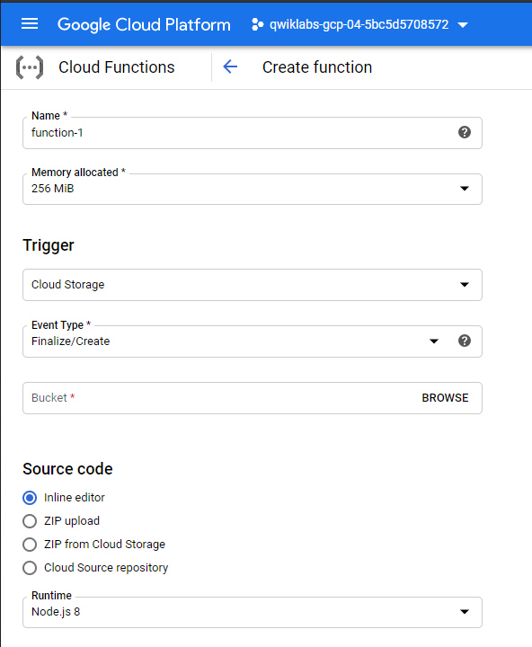
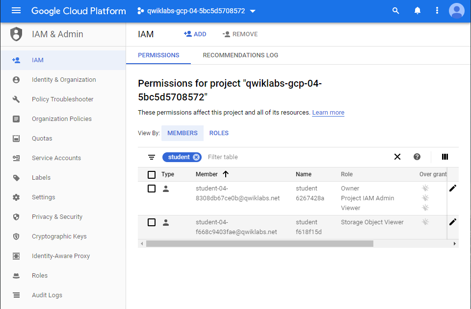

# **GSP315** Baseline Infrastructure: Challenge Lab

_Last modified: 2020-04-20_
_last verified: 2020-08-05_

## Tasks

1. Create a bucket
2. Create a Pub/Sub topic
3. Create the Cloud Function
4. Remove the previous cloud engineer

Create all resources in the us-east1 region and us-east1-b zone, unless otherwise directed.

Naming is normally team-resource, e.g. an instance could be named kraken-webserver1

## Task 1: Create a bucket

1. Click Navigation menu > Storage.

2. Click Create a bucket.

## Task 2: Create a Pub/Sub topic

1. Click Navigation menu > Pub/Sub > Topics.

2. Click Create a topic.

`kraken-topic`

## Task 3: Create the thumbnail Cloud Function

1. In the console, click the Navigation menu > Cloud Functions.

2. Click Create function.

3. In the Create function dialog, enter the following values:

| Field               |   Value       |
|---------------------|---------------|
| Function to execute | thumbnail     |
| Runtime             | Node.js 8     |
| Trigger             | Cloud Storage |



index.js:

```js
/* globals exports, require */
//jshint strict: false
//jshint esversion: 6
"use strict";
const crc32 = require("fast-crc32c");
const gcs = require("@google-cloud/storage")();
const PubSub = require("@google-cloud/pubsub");
const imagemagick = require("imagemagick-stream");

exports.thumbnail = (event, context) => {
  const fileName = event.name;
  const bucketName = event.bucket;
  const size = "64x64"
  const bucket = gcs.bucket(bucketName);
  const topicName = "kraken-topic";
  const pubsub = new PubSub();
  if ( fileName.search("64x64_thumbnail") == -1 ){
    // doesn't have a thumbnail, get the filename extension
    var filename_split = fileName.split('.');
    var filename_ext = filename_split[filename_split.length - 1];
    var filename_without_ext = fileName.substring(0, fileName.length - filename_ext.length );
    if (filename_ext.toLowerCase() == 'png' || filename_ext.toLowerCase() == 'jpg'){
      // only support png and jpg at this point
      console.log(`Processing Original: gs://${bucketName}/${fileName}`);
      const gcsObject = bucket.file(fileName);
      let newFilename = filename_without_ext + size + '_thumbnail.' + filename_ext;
      let gcsNewObject = bucket.file(newFilename);
      let srcStream = gcsObject.createReadStream();
      let dstStream = gcsNewObject.createWriteStream();
      let resize = imagemagick().resize(size).quality(90);
      srcStream.pipe(resize).pipe(dstStream);
      return new Promise((resolve, reject) => {
        dstStream
          .on("error", (err) => {
            console.log(`Error: ${err}`);
            reject(err);
          })
          .on("finish", () => {
            console.log(`Success: ${fileName} → ${newFilename}`);
              // set the content-type
              gcsNewObject.setMetadata(
              {
                contentType: 'image/'+ filename_ext.toLowerCase()
              }, function(err, apiResponse) {});
              pubsub
                .topic(topicName)
                .publisher()
                .publish(Buffer.from(newFilename))
                .then(messageId => {
                  console.log(`Message ${messageId} published.`);
                })
                .catch(err => {
                  console.error('ERROR:', err);
                });

          });
      });
    }
    else {
      console.log(`gs://${bucketName}/${fileName} is not an image I can handle`);
    }
  }
  else {
    console.log(`gs://${bucketName}/${fileName} already has a thumbnail`);
  }
};
```

package.json:

```json
{
  "name": "thumbnails",
  "version": "1.0.0",
  "description": "Create Thumbnail of uploaded image",
  "scripts": {
    "start": "node index.js"
  },
  "dependencies": {
    "@google-cloud/storage": "1.5.1",
    "@google-cloud/pubsub": "^0.18.0",
    "fast-crc32c": "1.0.4",
    "imagemagick-stream": "4.1.1"
  },
  "devDependencies": {},
  "engines": {
    "node": ">=4.3.2"
  }
}
```

**Upload** an image file to the bucket.

## Task 4: Remove the previous cloud engineer

1. In the console, click the Navigation menu > I AM.



2. Click the pencil icon, select **Delete**.
